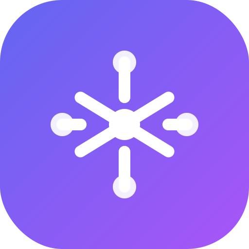

<p align="center">
  
</p>

<h1 align="center">🧠 MyStats</h1>

<p align="center">
  <strong>AI-Powered Self-Discovery & Career Strategy Engine</strong>
</p>

<p align="center">
  <em>Transform your scattered thoughts into actionable intelligence.<br/>Powered by Gemini, OpenAI, Claude, and Grok - built for thinkers who refuse to settle.</em>
</p>

<p align="center">
  <em>Model lineage: drafted with Gemini, refined with Claude Opus 4.5, finalized with GPT-5.2 Codex.</em>
  <br/>
  <em>모델 흐름: Gemini로 초안, Claude Opus 4.5로 다듬고, GPT-5.2 Codex로 마무리.</em>
</p>

<p align="center">
  <a href="#features"><strong>Features</strong></a> ·
  <a href="#3-step-usage-guide"><strong>3-Step Guide</strong></a> ·
  <a href="#demo"><strong>Demo</strong></a> ·
  <a href="#install-as-an-app-pwa"><strong>PWA</strong></a> ·
  <a href="#quick-start"><strong>Quick Start</strong></a> ·
  <a href="#memory-system-memu"><strong>Memory</strong></a> ·
  <a href="#tech-stack"><strong>Tech Stack</strong></a> ·
  <a href="#contributing"><strong>Contributing</strong></a>
</p>

<p align="center">
  
  
  
  
  
</p>

<p align="center">
  <a href="https://github.com/kks0488/mystats/stargazers">
    
  </a>
  <a href="https://github.com/kks0488/mystats/network/members">
    
  </a>
</p>

---

## ✨ Why MyStats?

> **"Most productivity apps ask what you did. MyStats decodes who you are."**

We don't just track your activities — we **uncover your hidden patterns**, identify your **psychological archetypes**, and generate **personalized strategies** that leverage your unique strengths.

```
📓 Journal Entry → 🧠 AI Analysis → 👤 Deep Profile → ⚡ Custom Strategy
```

---

## 🎯 Features

### 🧬 **Neural Memory Journal**
Write freely. Our AI doesn't just save — it **decodes**. Every entry is analyzed for:
- Skills (Hard & Soft)
- Personality Traits & Patterns
- Hidden Archetypes (e.g., "The Architect of Systems" 시스템의 설계자)
- Critical Questions you should be asking yourself

### 🧠 **memU Memory System (Embedded)**
MyStats now includes a built-in **memU-compatible memory layer**:
- **Embedded mode (default)**: runs entirely in the browser (no server required)
- Uses your **Journal entries as memory** for retrieval + similarity checks
- Strategy generation can automatically pull relevant memories as extra context

### 🤖 **Multi-AI Provider Switch**
Bring your own API key and choose your brain:
- Gemini
- OpenAI
- Claude
- Grok

### 🪞 **Deep Intelligence Profile**
Your cumulative psychological map — built from every journal entry. See:
- Existential Archetypes
- Hidden Behavioral Patterns  
- Critical Life Questions
- Skill & Interest Radar

### ⚡ **Neural Strategy Engine**
Describe a problem. Get a **ruthlessly personalized solution**:
- Unfair Advantage Analysis (What makes YOU uniquely positioned?)
- Mental Model Application (First Principles, 80/20, Inversion...)
- Concrete Action Plans
- Personal Blind Spot Warnings

### 📱 **Installable PWA (No App Store Needed)**
MyStats can be installed like an app on mobile/desktop via PWA:
- iOS/Android: add to Home Screen / Install app
- Offline-friendly app shell caching (data stays local-first)

---

## 📘 3-Step Usage Guide
**"Input your raw thoughts, AI generates your life strategy guide."**

### 1) Add an API Key
MyStats is **local-first** with no backend.
- **Setup:** Settings → API Key → Save
- **Recommended:** Google Gemini (free)
- **Privacy:** Your key/data stay only in your browser (no servers).

> Optional: Settings → memU Integration → keep **Embedded** to enable local memory retrieval from your journal.

### 2) Journal Freely
Write anything in `Journal` (no format required).
- Life path, skills/weaknesses, wins/fails, current struggles
- **Tip:** The more specific, the sharper the analysis.

### 3) Get Insights
Once you have entries, the AI turns them into insight.
- **🎯 Strategy:** A personalized plan based on your stats
- **🧠 Profile:** Hidden patterns + deep questions for growth

---

## 🎬 Demo

> **🎮 Try it now:** [https://mystats-eta.vercel.app](https://mystats-eta.vercel.app)

---

## 📲 Install as an App (PWA)

### iOS (Safari)
1. Open the demo link in Safari
2. Tap **Share**
3. Tap **Add to Home Screen**

### Android (Chrome)
1. Open the demo link in Chrome
2. Tap **Install app** (or ⋮ menu → Install app)

> Note: MyStats is local-first. Without cloud sync, your data is stored per device/browser.

## 🧩 Chrome "App" (Toolbar Launcher Extension)

If you want MyStats to behave like a simple Chrome app launcher, you can load the included extension:

1. Open `chrome://extensions`
2. Enable **Developer mode**
3. Click **Load unpacked**
4. Select `mystats/chrome-extension/`

Click the MyStats icon in the toolbar to open (or focus) the PWA.

---

## 🚀 Quick Start

### Prerequisites
- Node.js 18+
- API key (choose one):
  - [Google AI Studio - Gemini](https://aistudio.google.com/app/apikey) (Free)
  - [OpenAI](https://platform.openai.com/api-keys)
  - [Anthropic Claude](https://console.anthropic.com/settings/keys)
  - [xAI Grok](https://console.x.ai/)

### Installation

```bash
# Clone the repository
git clone https://github.com/kks0488/mystats.git
cd mystats

# Install dependencies
npm install

# Start dev server
npm run dev
```

### Setup
1. Open the app in your browser (check the terminal output; default is `http://localhost:5178`)
2. Go to the Dashboard
3. Enter your API Key (Gemini, OpenAI, Claude, or Grok)
4. Start journaling!

---

## 🧠 Memory System (memU)

MyStats ships with a **memU-compatible memory layer** that improves retrieval and strategy context.

### Embedded (default)
- Runs fully in the browser — **no server required**
- Uses your **Journal entries** as the memory store (IndexedDB / fallback local storage)
- Provides:
  - `retrieve` (top-K similar memories)
  - `check-similar` (similarity-based duplicate detection)

### Server (optional)
If you already run a local `memU` server, you can switch to **Server (API)** in Settings to:
- Use the memU REST API endpoint
- Optionally include `project-registry` memories in Strategy

---

## 🛠 Tech Stack

| Category | Technology |
|----------|------------|
| **Framework** | React 19 + Vite 7 |
| **Language** | TypeScript 5.9 (Strict Mode) |
| **Styling** | Tailwind CSS + shadcn/ui |
| **Animation** | Framer Motion |
| **AI Engine** | Gemini / OpenAI / Claude / Grok (bring your own key) |
| **Database** | IndexedDB (via idb) |
| **Validation** | Zod |
| **Icons** | Lucide React |

---

## 📂 Project Structure

```
mystats/
├── src/
│   ├── components/
│   │   ├── layout/      # Shell, Navigation
│   │   └── ui/          # shadcn/ui components
│   ├── db/              # IndexedDB operations
│   ├── hooks/           # Custom React hooks
│   ├── lib/             # Multi-AI providers, utilities
│   ├── pages/           # Home, Journal, Profile, Strategy
│   └── App.tsx
├── public/
└── package.json
```

---

## 🌍 Internationalization

MyStats supports:
- 🇺🇸 **English**
- 🇰🇷 **한국어 (Korean)**

Toggle language in the header.

---

## 🗒️ Release Notes

See `CHANGELOG.md`.

---

## 🔒 Privacy First

- **Local-first by default**: Journals/skills/insights are stored in your browser (IndexedDB)
- **No mandatory backend**: no tracking, no data collection
- **Your API Key**: direct connection to your provider in BYOK mode (we never see it)
- **memU Embedded**: runs locally in the browser
- **memU Server (optional)**: in API mode, entries may be sent to your local memU service
- **Export Anytime**: Download your data as JSON

---

## 🤝 Contributing

We love contributions! Please see our [Contributing Guide](CONTRIBUTING.md).

```bash
# Fork & Clone
git clone https://github.com/kks0488/mystats.git

# Create feature branch
git checkout -b feature/amazing-feature

# Commit changes
git commit -m "feat: add amazing feature"

# Push & create PR
git push origin feature/amazing-feature
```

---

## 📜 License

MIT License - see [LICENSE](LICENSE) for details.

---

## 🙏 Acknowledgements

- [Google Gemini](https://ai.google.dev/) for generation
- [OpenAI](https://platform.openai.com/) for generation
- [Anthropic Claude](https://www.anthropic.com/) for generation
- [xAI Grok](https://x.ai/) for generation
- [shadcn/ui](https://ui.shadcn.com/) for the beautiful components
- [Framer Motion](https://www.framer.com/motion/) for smooth animations
- All the open-source contributors who made this possible

---

<p align="center">
  <strong>⭐ If this helped you, give it a star!</strong>
</p>

<p align="center">
  <sub>Built with 🧠 + ☕ by <a href="https://github.com/kks0488">@kks0488</a></sub>
</p>
